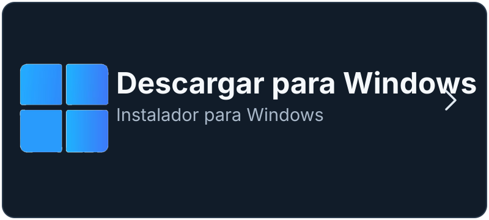

<p align="center">
  
</p>

<h3 align="center"></h3>
<p align="center"><small><span style="color:#8b98a9">Gestor de descargas y multimedia para Windows</span></small></p>
<p align="center">
  Clear Download Manager (CDM) es una aplicación local para Windows que organiza<br>
  descargas HTTP/HTTPS, vídeo, audio, playlists, torrents y enlaces directos.<br>
  Está construida con Tauri y Rust e incluye integración opcional con navegadores Chromium.
</p>

<p align="center">
  
</p>

<hr>

<h3><big>Descargar</big></h3>
<p>Elige la opción que prefieras para comenzar.</p>

<p align="center">
  <a href="https://github.com/CacaPlay/clear-download-manager-releases/releases/download/v0.95.0/Clear.Download.Manager_0.95.0_x64-setup.exe"></a>&nbsp;
  <a href="https://apps.microsoft.com/detail/9NSTJ7JXM843"></a>&nbsp;
  <a href="https://chromewebstore.google.com/detail/aonppfnabjnicjjeoofkfjofolfibggp"></a>
</p>

También puedes consultar el [release completo de Windows](https://github.com/CacaPlay/clear-download-manager-releases/releases/latest),
incluidos sus hashes, firma y metadatos del updater.

### ¿Qué necesito?

- **Instalar la aplicación:** usa el instalador de Windows o Microsoft Store.
- **Integrar el navegador:** instala la extensión desde Chrome Web Store.
- **Ya tienes CDM:** instala solo la extensión si necesitas enviar contenido
  desde el navegador.

## Qué hace

- Descargas HTTP/HTTPS con reanudación, cola persistente y progreso real.
- Descarga de vídeo, audio y playlists mediante yt-dlp.
- Torrents y enlaces magnet mediante aria2c.
- Procesamiento multimedia con FFmpeg y FFprobe.
- Historial SQLite, categorías, prioridades, concurrencia y límites de ancho de banda.
- Reproductor local con pantalla completa segura para cualquier relación de aspecto.
- Temas claro/oscuro/sistema y colores de acento sincronizados.
- Integración opcional con Chrome mediante Native Messaging.

## Uso básico

1. Abre CDM y pega un enlace, archivo, torrent o playlist.
2. Pulsa **Analizar** o elige la acción correspondiente.
3. Revisa la calidad, carpeta y prioridad antes de iniciar.

La aplicación conserva la cola, el historial y el orden en que se añadieron
las descargas en el equipo local.

## Verificar el instalador

El instalador publicado para CDM 0.95.0 es
`Clear.Download.Manager_0.95.0_x64-setup.exe`.

```powershell
Get-FileHash .\Clear.Download.Manager_0.95.0_x64-setup.exe -Algorithm SHA256
```

SHA-256 esperado:
`6f22a95cc288f1624951614544203f1eaaed80decd183db83ad6874ae290f880`

El archivo `SHA256SUMS.txt` del [repositorio de releases](https://github.com/CacaPlay/clear-download-manager-releases/releases/latest)
contiene el manifiesto completo.

## Requisitos

Windows x64, WebView2, Node.js y Rust/MSVC son necesarios para desarrollar.
Para instalar una versión publicada solo se necesita Windows compatible con el
instalador.

## Privacidad y soporte

CDM está diseñado para trabajar localmente. No incluyas instaladores, bases de
datos, logs, credenciales, cookies ni claves privadas en este repositorio.
Consulta la [política de privacidad de la extensión](docs/extension/PRIVACY.md),
[`SECURITY.md`](SECURITY.md) y
[`SUPPORT.md`](SUPPORT.md) para la información pública disponible.

## Desarrollo en Windows

Para preparar el entorno y ejecutar las comprobaciones actuales:

```powershell
npm.cmd ci --no-audit --no-fund
npm.cmd run check:release
npm.cmd run build:windows:final
```

La estructura principal es:

```text
app-ui/       interfaz, reproductor local y gestor de descargas
src-tauri/    motor Tauri/Rust, SQLite e IPC
extension/    extensión Chromium y host nativo
scripts/      compilación, validación y herramientas de mantenimiento
docs/         contratos técnicos y documentación de desarrollo
```

## Contribuir

Consulta [`CONTRIBUTING.md`](CONTRIBUTING.md) antes de enviar cambios. Las
reglas de seguridad están en [`SECURITY.md`](SECURITY.md) y la licencia en
[`LICENSE.md`](LICENSE.md).

El código se publica para facilitar la revisión y la colaboración técnica. La
licencia sigue siendo propietaria; revisa [`LICENSE.md`](LICENSE.md) antes de
redistribuir o modificar cualquier componente.
